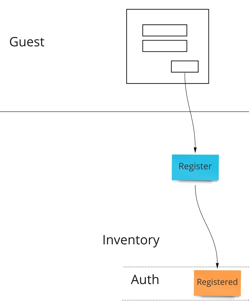
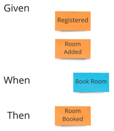

# Event Modeling With Evently

Event Modeling gives us an excellent way to understand all the events in a business, how they come to be via commands, and how they trigger processes and control state changes over time. Developers often employ CQRS and Event Sourcing as their implementation patterns. This post will show how to design your implementation with [Evently](https://evently.cloud), an online Event Ledger, as the Event Sourcing service.

Evently offers an easy-to-use API that only requires a [free access token](https://evently.cloud/#signup-form-container) to connect. Your code can live on a server, as is traditionally the spot where CQRS code lives, or it can live in ax browser or mobile device. Evently supports any HTTP client and provides CORS headers for browser app access.

## Example Domain–Hotel Operations

You are likely familiar with the Hotel Operations domain model used in Event Modeling talks and workshops. This blog’s [What is Event Modeling](/posts/what-is-event-modeling/) post uses this model to walk the reader through the mental model and processes of Event Modeling. As a refresher, here is the blueprint:


<sub>[high res version](/posts/what-is-event-modeling/blueprint_large.jpg)</sub>

We will be taking slices of this Event Model to present how you can use Evently’s features to bring the Hotel domain to life.

### Entity Definitions

Evently categorizes events around the concept of an Entity, an identifiable source of state. You can identify the Entity types by following the typical advice for identifying a DDD aggregate root. Entities can vary in their graininess, depending on how the business considers its operational value. Your application can use coarse-grained entities and the [Filter Selector API](https://evently.cloud/api/#operation/get-filter-selector-lookup) to select relevant events by data fields to build read models and atomically append events. For this post, we will use two Entity types.

##### Guest

A guest in the hotel industry books rooms at a property. The hotel business sees Guests as their customers. A guest must register an account to book rooms at hotel properties.

##### Property

The property defines an operations site in the hotel chain’s business. The property consists of rooms, staff and Guest amenities. Hotels do not consider individual rooms as entities but rather a type of saleable stock. When a Guest books a room, they do not book a specific room but rather a class of room, like two queens or a suite. When the Guest arrives, the front desk assigns an appropriate room for their stay.

### Slices

To show how to think about implementing the Event Model using Evently, we will select a few slices from the example and show the APIs you would use with Evently to build out the slice.

#### Cleaning Schedule


An interesting aspect of hotel operations is that rooms are cleaned only when a booking exists for the room class. The hotel optimizes the cleaning staff to prepare the rooms near each other and only clean rooms that need cleaning because of a guest's arrival. They will not clean a room that has no near-term revenue.
The cleaning staff need a Cleaning Schedule projection built to organize staffing levels and room order. They need two events: `Room Booked` and `Room Readied`. They need the first to identify the booked rooms, and they need the latter to mark off the rooms that are already prepared for check-in.

To fetch these events from Evently, they issue a replay selector request:

```http
POST https://preview.evently.cloud/selectors/filter
Content-Type: application/json
Authorization: Bearer <your-access-token>

{
  "entity": "Property",
  "keys": ["atomic-motel"],
  "events": [
    "Room Booked",
    "Room Readied"
  ],
  "after": "0005d13ee253e847da62cab2"
}
```

Events come in their append order, oldest to newest. The body’s newline-delimited content enables readable stream processing and supports TCP’s standard backpressure controls.

This request asks for the two relevant event types in the ‘atomic-motel’ Property entity. The events “catch-up” the client because the request includes an `after ` property, indicating the client has already read this selector in the past.

An `after ` contains either a Ledger mark or an event ID from a previous request and instructs Evently to only send new events that occur after this point in the Ledger. If the `after` value is unknown, then omit it, and Evently will send all the matching events in the Ledger.

#### New Guest Registration



In this slice, a new Guest wants to register an account by issuing a Register command. While this blueprint does not provide detail about the command and event, we can safely assume that a username should uniquely identify Guests. We want to execute this command in two steps to support this business goal.

##### Step 1: Search For Existing Guest Registrations

Ask Evently to select events from the Ledger that match a filter statement. If any events come back, we know that another Guest has already taken that user name.

```http
POST https://preview.evently.cloud/selectors/filter
Content-Type: application/json
Authorization: Bearer <your-access-token>

{
  "data": {
    "Guest": {
      "Registered": "$.username ? (@==\"mark_knopfler\")"
    }  
  }
}
```

This filter selector request asks Evently to send back `Registered` events in the `Guest` entity where the event data’s `username` is equal to our new Guest account `mark_knopfler`. The query format is [SQL JSONPath](https://evently.cloud/concepts/sql-jsonpath/), a JSONPath query language, part of the SQL2016 standard.

If no one else has created this user yet, Evently will send back an empty event list. In the response you will find a footer object that contains the `selectorId` and a Ledger `mark`. These values identify the selector query and where the result was read up to in the Ledger.

##### Step 2: Atomically Append the Guest Registered Event

Attempt to append a Registered event for `mark_knopfler`. We want to perform an atomic append, guaranteeing that no other Guest has registered with that username since we last executed the selector. If a matching event _has_ occurred since we ran the selector, Evently will issue a Race Condition error and the Guest must choose a new username.

```http
POST https://preview.evently.cloud/append/atomic
Content-Type: application/json
Authorization: Bearer <your-access-token>

{
  "entity": "Guest",
  "event": "Registered",
  "key": "96545681912005716892",
  "meta": {
    "causationId": "f_h59gj5-4jg03jdj45q"
  },
  "data": {
    "username": "mark_knopfler",
    "first": "Mark",
    "last": "Knopfler"
  },
  "idempotencyKey": "cw_3gFx2OE4jAIlUgmFtt",
  "selector": {
    "selectorId": "gaFkgadhY2NvdW50ga9hY2NvdW50LWNyZWF0ZWTZJSQubmFtZT8oQD09Im1pa2VfbWV5ZXJzQGV4YW1wbGUuY29tIik",
    "mark": "0000000000000000bee3f960"
  }
}
```

Let’s break down the body of the append request and explain the purpose of the different components.

###### Keys

In this event you will notice the `key` and `idempontencyKey` properties. They serve two different purposes. The `key` uniquely identifies the entity in the system. Systems often use personal information like account name or email address as a business key. However, in recent years this approach has been frowned upon as it can leak personal information beyond the confines of the trusted application. In this case, the application created a numbers-only [Nano ID](https://zelark.github.io/nano-id-cc/) to be the Guest’s business key.

The other key, `idempotencyKey`, optionally tells Evently that this append may be seen more than once, and it should ignore duplicates. The value, generated on the client, must be universally unique, so use Nano IDs or UUIDs for this key.

###### Atomicity

The request body also has the selector object that identifies the `selectorId` and Ledger `mark` to verify that no new matching events have been appended to the Ledger. If the selector is quiescent, Evently will append the event. Atomic append does not block other unrelated events from being appended to the Ledger; it only controls events that match the filter selector definition after the Ledger mark.

###### Meta and Data

The `data` property contains the event-specific data. It can be any JSON value, even simple `true` and `false`. It usually presents as an object, as most events have more than one property they collect.

Another valuable part of the request body is the `meta` field. This field provides a place to store application-relevant, cross-cutting information about the event. Typical properties are causation ID, correlation ID, actor, and device ID. Applications can fetch events by `meta` values using the same SQL JSONPath language as `data` to fetch events with [filter selectors](https://evently.cloud/api/#operation/get-filter-selector-lookup).

#### GPS Notifications

The Event Model calls for a mobile app that can notify the system the whereabouts of the Guest.


The developer knows that these events are often sent while a mobile device is transitioning from hotel WiFi to the mobile provider’s network. The connection may be difficult to maintain, and event append requests could be lost. The model allows many location events to be sent in any order, relieving the application of tracking entity state with selector-fed read models.

##### Factual Append with Idempotency

The mobile device does not need to compute a read model before emitting a location event, so it can send an event as a [simple fact](https://evently.cloud/api/#operation/post-append-fact-form).

```http
POST https://preview.evently.cloud/append/fact
Content-Type: application/json
Authorization: Bearer <your-access-token>

{
  "entity": "Guest",
  "event": "Guest Located",
  "key": "96545681912005716892",
  "meta": {
    "deviceId": "mobile-device-id"
  },
  "data": {
    "lat": 50.04836,
    "long": 8.56790
  }
}
```

Factual events are cheap and easy to append to a Ledger. They have been designed for IoT scenarios where the application does not need to hydrate state before processing a command.

## Testing

People enjoy writing unit tests for Event Model implementations because test setup and execution does not rely on mocking services or storage systems for the purely-functional Command handlers, process managers and read models. However, integration testing does require system state to be present and manipulable in a sandbox to ensure all the connections between components function correctly.



Evently plays its part in integration testing by offering development Ledgers. Development Ledgers can be reset to a specific Ledger mark or event ID, or reset completely to an empty state. (In the current Evently preview, all Ledgers are development ledgers.) Evently integration testing can follow this workflow:

1. [Reset the Ledger](https://evently.cloud/api/#operation/get-reset-ledger-form) to the beginning or to a specific event ID / Ledger mark.
2. Set up starting state by appending factual events.
3. Execute tests. The tests will select events for read models and projections, and append events to the Ledger as part of their normal operation.
4. Select events for verification. The test can then select appropriate events using replay and filter selectors to ensure the right events were appended in the right order.

Once the testing has passed, the code is ready for use. For production uses, Evently has permanent Ledgers that cannot be reset. They operate the exact same way as development Ledgers, so only the access token needs to be switched to the permanent Ledger at runtime.

### Coming Soon…

Evently is currently in preview mode, and only offers the development Ledger. However, new capabilities like permanent Ledgers will be available in 2022, so [sign up](https://evently.cloud/#signup-form-container) for your access token and start learning now! Evently offers a couple of [tutorials](https://evently.cloud/tutorials/thermostat/) to get you going.
